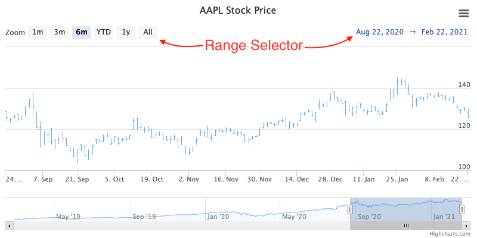

Range selector
================

The range selector is a tool for selecting ranges to display within the chart. It provides buttons to select pre-configured ranges in the chart, like 1 day, 1 week, 1 month, etc. It also provides input boxes where min and max dates can be manually input.

 

Vertical position
-----------------

The range selector box can be positioned vertically.

Allowed properties are:

*   top (by default)
*   middle
*   bottom

```js
rangeSelector: {
	verticalAlign: 'top',
	x: 0,
	y: 0
},
```

Use the x and y options to customize position. The x and y options offset the selector by pixels from the given alignment.


Floating
--------

The option allows to skip adding extra space for range selector. [See a live demo](https://jsfiddle.net/gh/get/library/pure/highcharts/highcharts/tree/master/samples/stock/rangeselector/floating/).

```js
rangeSelector: {
	floating: true,
	y: 250
},
```

 

Input position / button position
--------------------------------

The input boxes, which handle the `from` and `to` dates, can be positioned individually using the following options:

*   align (left, center, right)
*   x
*   y

For example, we can make them swap places like this:

```js
rangeSelector: {
	inputPosition: {
		align: 'left',
		x: 0,
		y: 0
	},
	buttonPosition: {
		align: 'right',
		x: 0,
		y: 0
	},
},
```


Input type
----------

The option `inputDateFormat` is used to determine which type of input to show, `datetime-local`, `date` or `time` and falling back to `text` when the browser does not support the input type or the format contains milliseconds. The default setting of `%b %e, %Y` for example is going to show a `date` input when the browser supports it, while the example below is going to result in a `datetime-local` input:

```js
rangeSelector: {
	inputDateFormat: '%b %e, %Y %H:%M'
},
```

Responsive
----------

By default the range selector buttons will collapse into a dropdown when there is not enough room to show everything in a single row, this behaviour can be controlled using the `dropdown` option. More info on this can be found in the [API docs](https://api.highcharts.com/highstock/rangeSelector.dropdown)


Data grouping
---------------------------

Range Selector buttons can control **data grouping** - the granularity of data applied when a certain range is selected. This allows each button to specify how the displayed data range should be grouped. See a live example in the [Range Selector demo](https://jsfiddle.net/gh/get/library/pure/highcharts/highcharts/tree/master/samples/stock/demo/rangeselector-datagrouping/).

```js
rangeSelector: {
  buttons: [{
    type: 'month',
    count: 3,
    text: 'Day',
    dataGrouping: {
      forced: true,
      units: [['day', [1]]]
    }
  }, {
    type: 'year',
    count: 1,
    text: 'Week',
    dataGrouping: {
      forced: true,
      units: [['week', [1]]]
    }
  }, {
    type: 'all',
    text: 'Month',
    dataGrouping: {
      forced: true,
      units: [['month', [1]]]
    }
  }]
}
```

More information about general data grouping behavior can be found in the [Data grouping](https://www.highcharts.com/docs/stock/data-grouping) page.

You can also enable the `preserveDataGrouping` option to keep the data grouping for selected range active when the chart extremes change through other interactions, such as zooming or moving navigator. By default, this option is disabled, causing data grouping to reset whenever the visible range moves outside the selected range. See the full option reference at the [API docs](https://api.highcharts.com/highstock/rangeSelector.preserveDataGrouping).

Custom button click event
-------------------------

Each range selector button can get a custom action as shown in this example:

```js
rangeSelector: {
	buttons: [{
		type: 'month',
		count: 1,
		text: '1m',
		events: {
			click: function() {
				alert('Clicked button');
			}
		}
	}, {
		type: 'month',
		count: 3,
		text: '3m'
	}, {
		type: 'month',
		count: 6,
		text: '6m'
	}, {
		type: 'ytd',
		text: 'YTD'
	}, {
		type: 'year',
		count: 1,
		text: '1y'
	}, {
		type: 'all',
		text: 'All'
	}]
},
```

See the [API reference](https://api.highcharts.com/highstock/rangeSelector) for the rangeSelector option for more information on how to set up the range selector tool.
